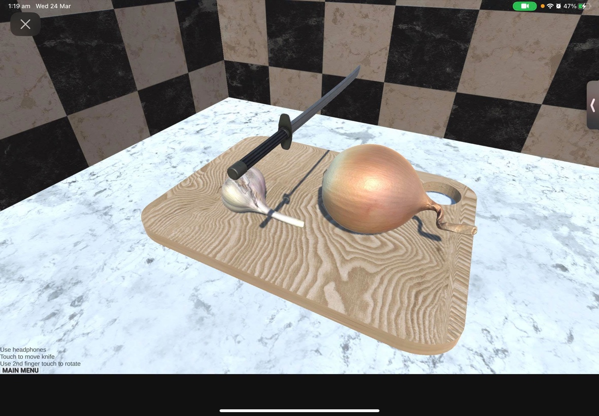
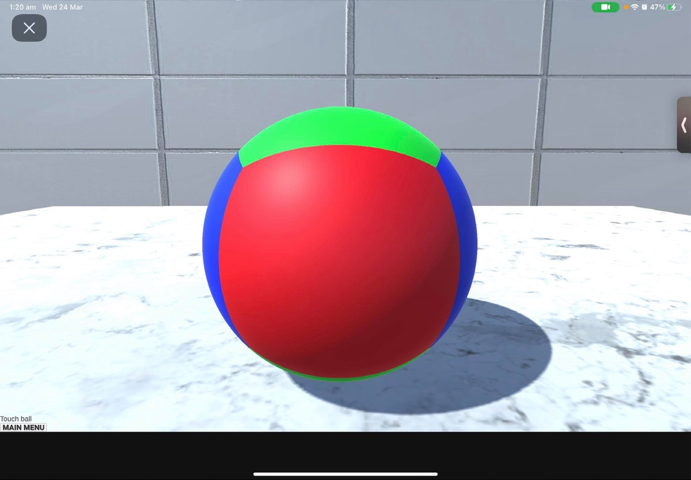

# 3D ASMR Stress Relief Game — Project Report

**Final Year Project · Computer Science**  
**Author:** Zayan Khan

---

## 1. Introduction

This document outlines the motivation, design, and implementation of a **3D ASMR stress relief game** built in Unity. The project focuses on the ideas behind satisfying videos and popular ASMR content, and explores how an interactive 3D game that uses those same triggers could help reduce stress, anxiety, and potentially depression over time.

### 1.1 Aims

- To design and implement a playable 3D game that uses **satisfying** and **ASMR-style** interactions (slicing, touching, deforming, sound).
- To make the game **touch-first** and **physics-driven** so that feedback feels immediate and controllable.
- To provide a proof-of-concept that such a game could support **stress and anxiety reduction** (and possibly mood) when used over time.

---

## 2. Background and rationale

### 2.1 Satisfying videos and ASMR

- **Satisfying videos** (e.g. cutting soap, slime, sand, food) are built on repetition, predictability, and clear cause-and-effect. Viewers often report relaxation and a sense of control.
- **ASMR (Autonomous Sensory Meridian Response)** uses specific sounds and visuals (whispers, taps, crunches, soft textures) to trigger a calming, tingling response. It is widely used for relaxation and sleep.

Research and user reports suggest that both can help with **stress and anxiety**. The mechanisms are not fully proven, but likely involve:

- **Attention narrowing** — focus on one simple, predictable task.
- **Sense of control** — the viewer (or player) feels in charge of the outcome.
- **Multisensory engagement** — sound, sight, and in our case touch, without real-world pressure.

### 2.2 Why a 3D game?

- **Interactivity** — the user *does* the action (slice, tap, squish) instead of only watching. This can strengthen the sense of control and presence.
- **Touch** — on a phone or tablet, touch adds a direct, tactile dimension that matches how many people use ASMR and satisfying content (e.g. on mobile).
- **Repeatability** — a game can be played again and again, which fits the repetitive, ritual-like nature of stress-relief habits.
- **Scalability** — the same build can be run on desktop (mouse) and mobile (touch), and could be extended with more objects, sounds, and scenarios.

We therefore propose that a **3D ASMR game** that combines satisfying mechanics (slicing, deformation), sound design (chop sounds, etc.), and touch-friendly controls could be an effective and engaging tool for stress and anxiety relief, with potential benefits for low mood over time.

---

## 3. Design

### 3.1 Core mechanics

| Mechanic | Purpose |
|----------|---------|
| **Slicing** | Repetitive, controlled cutting (onions, garlic, sand) with visual and audio feedback. Mimics satisfying “cutting” content. |
| **Touch control** | Move and rotate the knife with one or two fingers. Keeps interaction simple and suitable for mobile. |
| **Deformable surfaces** | Tap/drag to dent a mesh; it springs back. Adds a “stress ball” style, tactile feel. |
| **Jelly wobble** | Soft bodies that jiggle and settle. Adds variety and a calming, bouncy feedback. |
| **Procedural shapes** | Rounded cubes and cube-spheres for slicing and squishing without relying only on art assets. |

### 3.2 Levels in the dissertation build

The submitted Unity build had three levels, each testing a different kind of satisfying interaction:

| Level | Interaction |
|-------|-------------|
| **Vegetable slicing** | Move the knife with one finger, rotate with a second. Onion and garlic split into physical pieces with chopping audio. |
| **Stress ball** | A generated cube-sphere that dents under touch and springs back. |
| **Cloth** | A script-generated hanging cloth surface to touch and manipulate. |

  
  

The browser port later extended these into 30 levels across three worlds (see the [README](../README.md)).

### 3.3 Development process

Agile with Scrum-style sprints, each ending in a working build. Touch input was tested throughout with Unity Remote on an iPad Air 4, and a hosted build was made at the end of each sprint. An early input prototype (swipe and tap detection) is kept in [`Prototypes~/`](../Prototypes~/touch-swipe-test/README.md).

### 3.4 User experience

- **Primary platform:** Touch screen (phone/tablet), with headphones recommended for ASMR-style audio.
- **Secondary:** Desktop with mouse for deformation; slicing can be tested with touch emulation or mapped keys if needed.
- **Flow:** Open the game → choose or enter a scene → slice, tap, and squish with immediate visual and audio feedback.

---

## 4. Implementation

### 4.1 Technology

- **Unity** (C#) for the game engine, physics, and input.
- **EzySlice** for real-time mesh slicing (cutting objects into two hulls with materials and colliders).
- **Custom C# scripts** for:
  - Touch-based knife control
  - Trigger-based slice detection
  - Spring-mass mesh deformation
  - Jelly-style vertex motion
  - Procedural mesh generation (rounded cube, cube-sphere, grid)

### 4.2 Key systems

- **Slicing:** A “slicer” object uses `Physics.OverlapBox` to find sliceable objects (tagged e.g. onion, garlic, sand). When triggered (e.g. by collision), EzySlice produces upper and lower hulls; materials, colliders, and rigidbodies are applied so the pieces fall and can be re-sliced.
- **Audio:** An `AudioSource` on the knife (or trigger) plays a chop sound when it hits onion/garlic (and optionally other tags), synced with the slice.
- **Deformation:** A `MeshDeformer` holds original and displaced vertices and applies forces from input (e.g. mouse raycast). Vertices are updated with spring and damping for a soft, recoverable dent.
- **Jelly:** A separate per-vertex system that oscillates positions for a wobble effect, with intensity varying by height.

### 4.3 Mesh generation and deformation

- **Generated meshes:** the cloth plane, the cube and the sphere are all built from script rather than imported, so vertex density can be tuned. A plane is a grid of `Vector3` vertices with triangles stored as index triples; a cube is six such faces sharing edge and corner vertices.
- **Cube to sphere:** each cube vertex is mapped onto a sphere in `CubeSphere.SetVertex`, using the cube-to-sphere formula from Catlike Coding's tutorial, which distorts the corners less than plain normalisation.
- **Force falloff:** a touch adds force to every vertex, attenuated by distance as `force / (1 + d²)`. The `1 +` avoids an infinite force at the touch point, and stops the whole mesh moving as one.
- **Force to velocity:** with mass treated as 1, acceleration equals force, so velocity change is `force × Δt`, applied along the direction from the touch point to the vertex.
- **Spring back and damping:** each frame `velocity -= displacement × springForce × Δt` pulls vertices toward their original position, then `velocity *= 1 − damping × Δt` removes energy. Without damping the ball keeps oscillating unrealistically.

For a full list of scripts and responsibilities, see [Architecture & scripts](ARCHITECTURE.md).

---

## 5. Running and building the project

- **In editor:** Open the project in Unity, open the main scene, press Play. See [Building & running](BUILD_AND_RUN.md) for step-by-step setup.
- **On device:** Build to Android or iOS from File → Build Settings for touch gameplay.
- **Web (optional):** Build as WebGL and host on itch.io or GitHub Pages so others can try it in the browser (with touch if supported).

---

## 6. Limitations and future work

- **Scenes and assets:** The repo may not include every scene or asset from the original submission; some prefabs or scenes might need to be recreated or re-linked.
- **Research:** A small user study (17 participants) was run for the dissertation; see [Research & evaluation](RESEARCH_AND_EVALUATION.md). It shows most players felt some relaxation, but it is self-reported and short-term. A larger study with pre/post stress measures and a control group would be needed to claim measurable effects.
- **Future directions:** More sliceable objects, more ASMR sounds, guided “sessions,” optional analytics (e.g. play time), and accessibility options (e.g. reduced motion, subtitles) could extend the project.

---

## 7. Evaluation summary

Seventeen Brunel students and staff played the game in a browser and completed a questionnaire. Full method and results are in [Research & evaluation](RESEARCH_AND_EVALUATION.md). Headlines:

- 15 of 16 felt at least slightly more relaxed; 7 felt clearly more relaxed.
- Vegetable slicing was the favourite level for 13 of 16.
- 12 of 16 would recommend it for stress relief; average rating 3.75 / 5.
- Only 9 of 15 said it ran smoothly on their device, and bugs were the most common criticism.

## 8. Conclusion

This project demonstrates a 3D ASMR stress relief game that combines satisfying slicing, deformable surfaces, jelly-style motion, and touch-focused controls. The rationale is grounded in the popularity and reported benefits of satisfying and ASMR content, and in the potential of interactive, touch-based 3D experiences to support stress and anxiety reduction. The user study supports slicing as the strongest concept and shows that audio quality and reliability matter as much as the mechanics. The implementation is modular and documented so that others can run, build, and extend the game for further experimentation or research.
